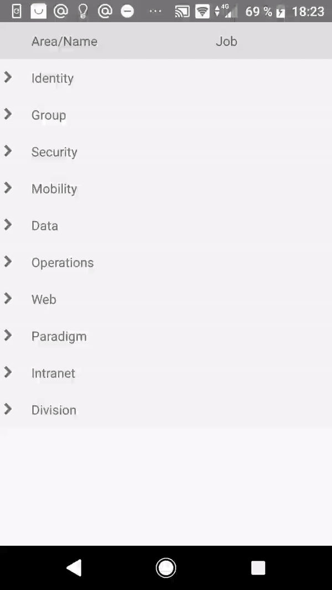

# react-native-tree-view

React Native component for hierarchical data representation.
Has expandable row, which useful for displaying large amounts of information in vertical space. 

## Show Cases



## Getting Started

- [Installation](#installation)
- [Basic Usage](#basic-usage)
- [Properties](#properties)
  + [Basic props of `TreeView`](#basic-props-of-treeview)
  + [Cells definition](#cells-definition)
- [Run example](#run-example)

### Installation

Install main package:

```bash
$ npm i --save @captain-omega/react-native-tree-view
```

Install related icons package [react-native-vector-icons](https://github.com/oblador/react-native-vector-icons):

```bash
$ npm i --save react-native-vector-icons
```

Add settings for your platform, see more [here](https://github.com/oblador/react-native-vector-icons#installation)

#### IOS
```bash
react-native link react-native-vector-icons
```

#### Android

Edit `android/app/build.gradle` ( NOT `android/build.gradle` ) and add the following:
```
apply from: "../../node_modules/react-native-vector-icons/fonts.gradle"
```

### Basic Usage

- Install `@captain-omega/react-native-tree-view` package to project 

- Import module to file

```jsx
import TreeView from '@captain-omega/react-native-tree-view';
```

- Then, use component like this:

```jsx
<TreeView  
  cells={level1}
  data={data}  
  renderExpand={(item) => (
    <TreeView
      hideHeaders
      cells={level2}
      data={item.children}
      hideArrow
    />
  )}
/>
```

You can watch more examples in `example` directory

### Properties

#### Basic props of `TreeView`

| Prop  | Default  | Type | Description |
| :------------ |:---------------:| :---------------:| :-----|
| cells | - | `array` | An array of objects that each describe a cell. See the `cells` property definition [here](#cells-definition). |
| contentStyle | {} | `style` | See default style in source. |
| data | - | `array` | The array of table rows. |
| headerStyle | {} | `style` | See default style in source. |
| hideArrow | false | `bool` | Hide column with arrows if this parameter is `true`. |
| hideHeaders | false | `bool` | Hide component headers. |
| isExpandable | null | `function` | Function that return `true` if row is expandable and `false` if it doesn't. |
| open | false | `bool` | Open all expandable rows by default. |
| onPress | null | `function` | Handle row press event. |
| renderExpand | null | `function` | Render function for expandable content. If this parameter is `null`, then row not expandable. |

#### Cells definition

| Prop  | Default  | Type | Description |
| :------------ |:---------------:| :---------------:| :-----|
| cellStyle | {} | `style` | Set row cell style. |
| headerCellStyle | {} | `style` | Set header cell style. |
| renderHeaderCell | - | `function` | Render header cell content. |
| renderRowCell | - | `function` | Render row cell content. |
| width | 30 | `number` | Width of column. |

### Run example

To run example call this commands in terminal:

```bash
$ cd example
$ npm i
$ react-native run-android
$ react-native run-ios
```

#### Notice!

If your `npm` not support symlinks, then call this code from repository root directory:

```bash
$ mkdir example/node_modules/@captain-omega
$ cp -alf $PWD example/node_modules/@captain-omega
$ rm -R example/node_modules/@captain-omega/react-native-tree-view/example
$ cd example
$ react-native run-android
$ react-native run-ios
``` 
